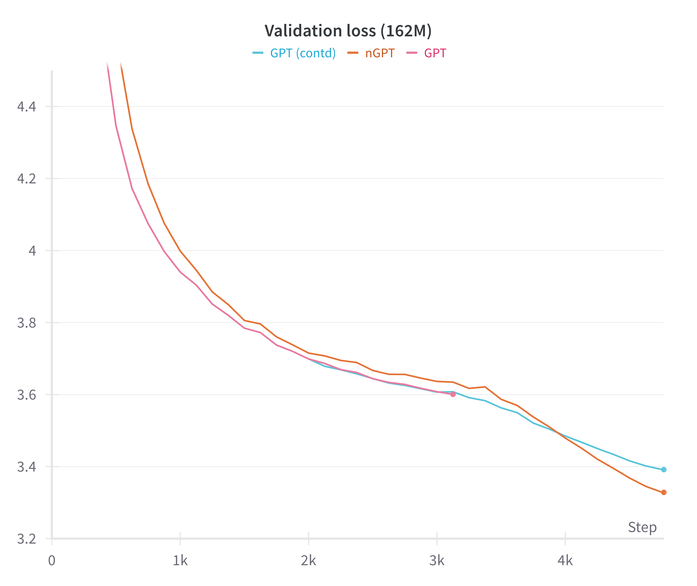
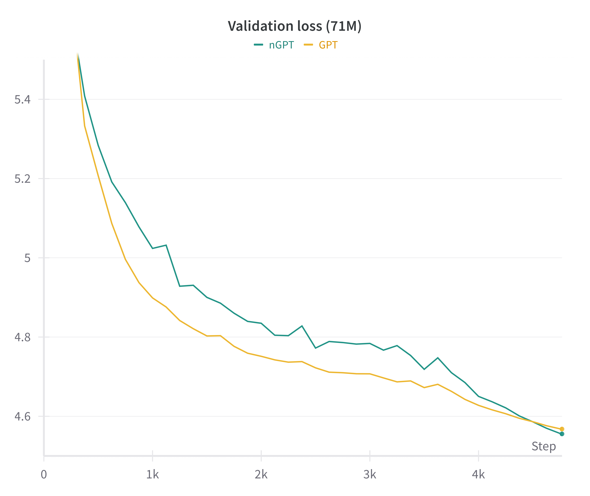
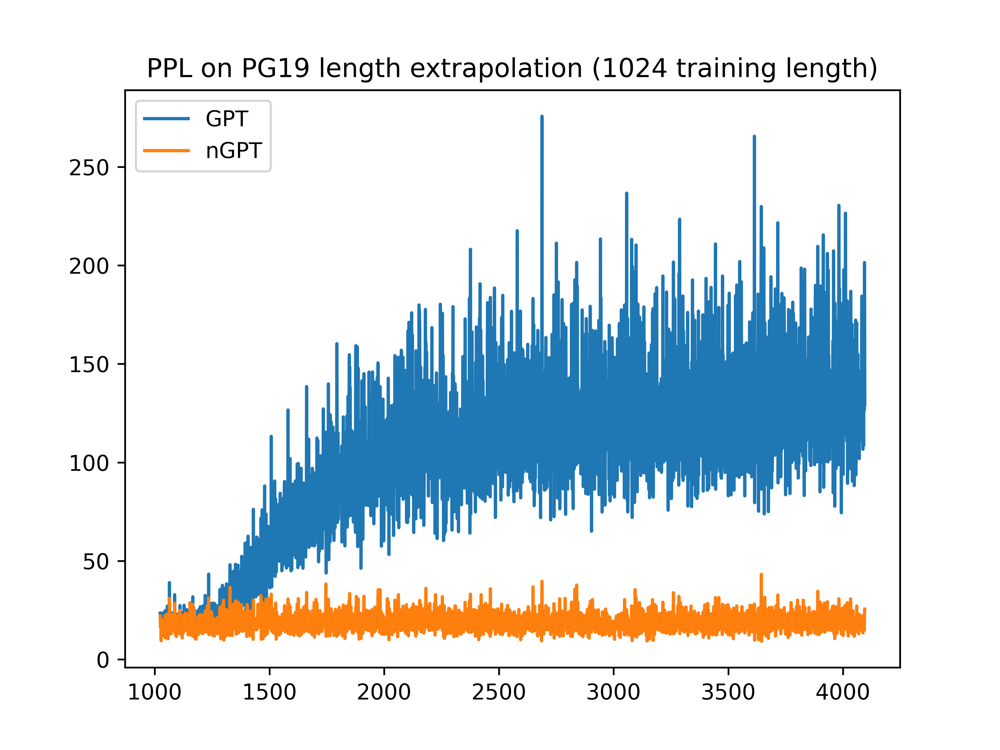
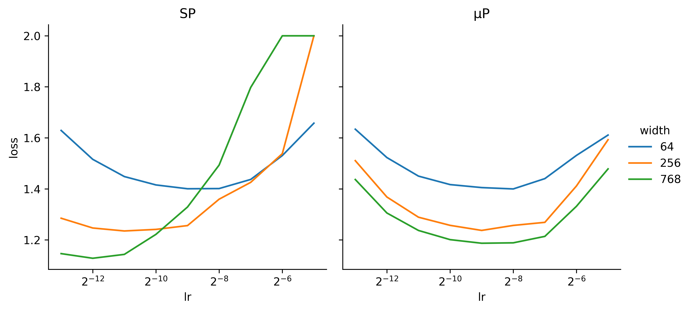
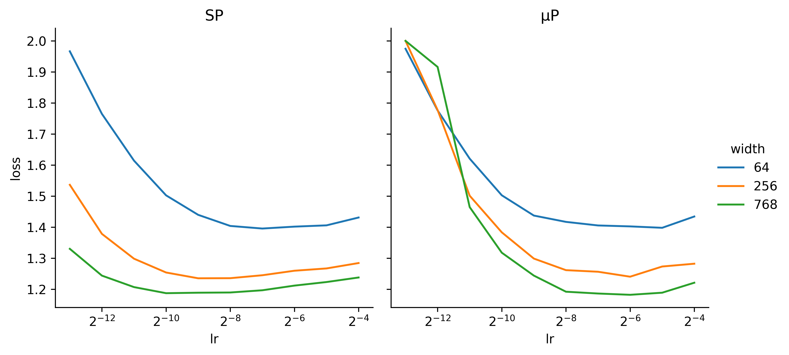
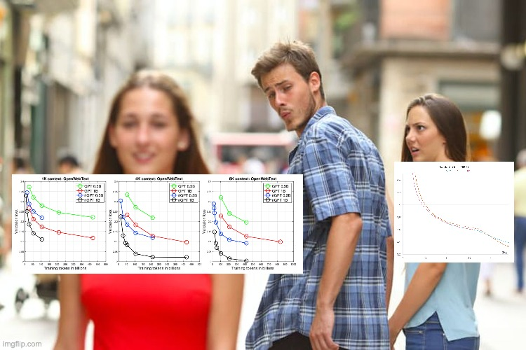

# Modded-NanoGPT : a replication attempt of nGPT

This repo is a fork of the [modded-nanogpt](https://github.com/KellerJordan/modded-nanogpt) which allows easy test and play of different methods to improve LLMs training. This repo is specifically intended as an attempt to reproduce the results of the [nGPT paper](https://arxiv.org/abs/2410.01131).

I used a smaller model than what is used in the paper (162M vs 0.5B and 1B) and far fewer tokens (2.5B vs 500B). But I guess we have to start somewhere to try and verify the results by ourselves.

This is the validation loss curves for GPT and nGPT, on 2.5B tokens on FineWeb:

You see how nGPT is lacking behind the whole time, but catches up and even beats the baseline during the cooldown phase of the WSD schedule.

By "GPT", I mean the [modded-nanogpt](https://github.com/KellerJordan/modded-nanogpt) baseline using AdamW (I derived the current implementation and removed all the tricks and enhancements like Muon, QK norm, zero init... and switched back to something very similar to the original nanogpt). This is implemented in the `train_gpt2.py` file.

By "nGPT", I mean the normalized version of this baseline, as described quite precisely in section 2.6 of the [nGPT paper](https://arxiv.org/abs/2410.01131). This is implemented in the `train_ngpt2.py` file.

Here is another experiment, at a smaller scale:

Same observations : lacking behind the whole time, but catches up at the end.

Note that GPT term here isn't correct here because 1) RoPE is used 2) a Llama MLP block is used but I choosed to followed what was done in the paper. No weight tying employed (that's why no 124M parameters)

Next up, I wanted to check the length extrapolation capabilities of a trained GPT vs nGPT, inspired by the figure 13 of the paper. This is the result for the 162M models on the PG19 dataset :

Quite impressive compared to the GPT baseline. Note that the overall shape of the curves don't match the figure 13 of the nGPT paper (the GPT perplexity is supposed to shoot up but here it kinds of levels off..)

Notes about my experiments / potential things to look upon :
- the slowdown incurred by nGPT over GPT is only about 20%, as opposed to 80% reported in the paper. Note that I used the latest `2.5` version of pytorch.
- I used the WSD LR scheduler, as opposed to cosine scheduler in the paper.
- the behavior of "nGPT catching up and beating GPT during the cooldown" is a bit weird, maybe try to make the slowdown longer ? (proposed by @Grad62304977)

I used muP for both GPT and nGPT to fix the LR of `2**(-9)` thanks to a sweep at `n_embd=64`. I used it in a "non-invasive" way as I like to call it : at the desired width `n_embd=768` I fixed SP=muP. See [this](https://x.com/AlexandreTL2/status/1841056891801104472).

This is test sweep LR I have done with the GPT baseline to check for the correctness of my muP implementation :

And the same for nGPT:

Feel free to reach me/open PR if you have any questions/suggestions. I can provide you with the trained models for example.

